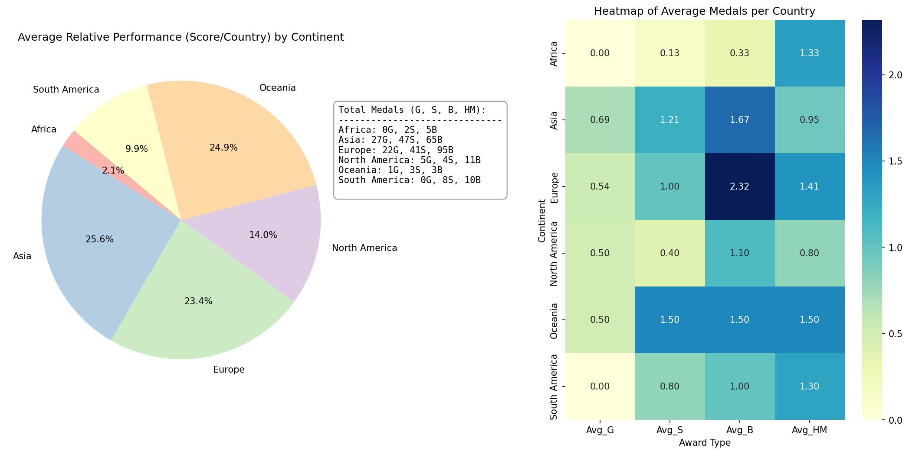

<p align="center">
  
</p>
<p align="center">
<a href="https://github.com/ishandutta2007/Awesome-Awesome-Awesome"></a><a href="https://discord.gg/jc4xtF58Ve"></a>
</p>

# 🏆 IMO 2026 - Regional Performance Analysis 🌍 | International Mathematical Olympiad Data Science

Welcome to the **IMO 2026 Regional Performance Analysis** repository! This open-source data science project provides a comprehensive statistical analysis of the relative performance of different continents at the **International Mathematical Olympiad (IMO) 2026**. 📊 

Leveraging Python, Pandas, and Data Visualization techniques, this project analyzes the provided CSV dataset containing the global mathematical competition medal counts (Gold 🥇, Silver 🥈, Bronze 🥉) and Honorable Mentions 🎖️ for each participating country.

## 🧮 Scoring Methodology & Data Analytics

To fairly compare continents, this analysis uses a weighted points system to assess overall performance:
*   🥇 **Gold Medal**: 5 points
*   🥈 **Silver Medal**: 3 points
*   🥉 **Bronze Medal**: 1 point
*   🎖️ **Honorable Mention**: 0 points

Additionally, because the number of participating countries varies widely by continent, the metrics are **normalized by the number of countries** in each continent. 📈 This results in a "per-country average" for both medal counts and the overall weighted score, giving a much more accurate representation of relative regional strength. 🧠

## 📈 Visualizations

The analysis generates two primary visualizations:
1.  🥧 **Pie Chart**: Shows the distribution of the average weighted score per country across continents.
2.  🗺️ **Heatmap**: Displays the average number of each award type (Gold, Silver, Bronze, HM) won per country for every continent.



## 🚀 How to Run

### 🛠️ Prerequisites
You need Python 🐍 installed along with the `pandas`, `matplotlib`, and `seaborn` libraries. 

You can install the dependencies via pip:
```bash
pip install pandas matplotlib seaborn
```

### 💻 Execution
Run the analysis script to generate the updated plot:
```bash
python analyze.py
```
This will read from `imo_2026_medals.csv` 📁 and output/overwrite the `assets/imo_2026_continent_performance.png` 🖼️ image.